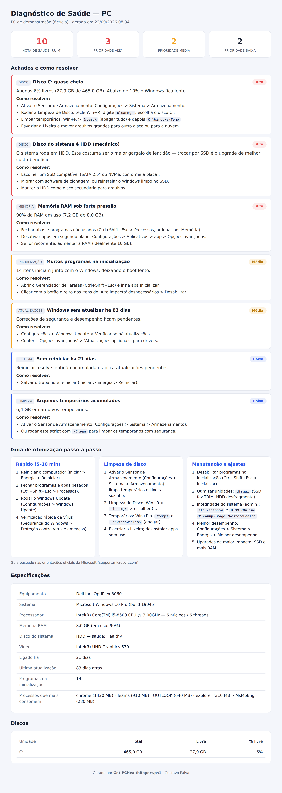

# PC Health Check — Diagnóstico de Computador

> Script PowerShell que levanta as especificações de um PC Windows, detecta o que está deixando a máquina lenta e gera um relatório HTML com recomendações priorizadas.


---

## Problema

No suporte de TI, "meu computador está lento" é o chamado mais comum — e o diagnóstico costuma ser manual: abrir o Gerenciador de Tarefas, olhar disco, checar RAM, ver o que inicia com o Windows. Demora e depende da experiência de quem atende.

## Solução

Um único script que faz esse diagnóstico em segundos e entrega um **relatório HTML** com:

- **Especificações completas** — equipamento, sistema, CPU, RAM, disco (tipo e saúde), vídeo, uptime.
- **Achados priorizados** — o que está pesando: disco cheio, HDD em vez de SSD, RAM sob pressão, muitos programas na inicialização, Windows desatualizado, temporários acumulados, tempo sem reiniciar.
- **Como resolver** — cada achado vem com um passo a passo concreto e os comandos (`cleanmgr`, `%temp%`, `sfc /scannow` etc.).
- **Guia de otimização** — um playbook de limpeza e manutenção baseado nas orientações oficiais da Microsoft.
- **Nota de saúde (0–100)** para bater o olho e priorizar.
- **Limpeza opcional** — o parâmetro `-Clean` remove os arquivos temporários com segurança (ignora os que estão em uso).

Serve tanto de **projeto de portfólio** quanto de **ferramenta real de trabalho**: rode em qualquer máquina para um raio-x na hora.

## Demonstração



> Exemplo em modo demonstração, com um PC propositalmente problemático (HDD, disco a 6% de espaço livre, RAM a 90%, 83 dias sem atualizar). O script deu nota 10/100 e listou 7 pontos de melhoria.

## Stack

- **PowerShell 5.1 e 7** (roda no PowerShell nativo do Windows, sem instalar nada)
- **CIM/WMI** (`Win32_*`, `Get-PhysicalDisk`, `Get-HotFix`) para coletar o hardware
- HTML + CSS para o relatório (sem dependências externas)

## Como usar

### Na máquina que você quer diagnosticar

```powershell
# baixe/clone o projeto e entre na pasta
cd pc-health-check

# rode (não precisa ser administrador; como admin, alguns dados ficam mais completos)
powershell -ExecutionPolicy Bypass -File .\Get-PCHealthReport.ps1

# abra o relatório
Invoke-Item .\output\pc-health-report.html
```

### Diagnosticar e já limpar os temporários

```powershell
.\Get-PCHealthReport.ps1 -Clean
```

### Modo demonstração (com o PC de exemplo)

```powershell
.\Get-PCHealthReport.ps1 -DemoData
```

### Parâmetros

| Parâmetro | Padrão | Descrição |
|-----------|--------|-----------|
| `-DemoData` | (desligado) | Usa o PC simulado (`data/demo-pc.json`), sem coletar da máquina. |
| `-Clean` | (desligado) | Limpa com segurança os arquivos temporários (`%TEMP%` e `Windows\Temp`). |
| `-OutputPath` | `output/pc-health-report.html` | Caminho do relatório gerado. |
| `-DataPath` | `data/demo-pc.json` | JSON de demonstração (com `-DemoData`). |

## O que ele verifica

| Área | Regra | Gravidade |
|------|-------|-----------|
| Disco | Menos de 10% livres | Alta |
| Disco | Disco do sistema é HDD | Alta |
| Disco | Saúde do disco diferente de "Healthy" | Alta |
| Memória | RAM em uso ≥ 90% | Alta |
| Memória | Menos de 8 GB instalados | Média |
| Inicialização | Mais de 10 programas no boot | Média |
| Atualizações | Windows sem atualizar há mais de 45 dias | Média |
| Sistema | Mais de 7 dias sem reiniciar | Baixa |
| Limpeza | Mais de 3 GB em temporários | Baixa |

## Estrutura

```
pc-health-check/
├── Get-PCHealthReport.ps1     # o script (coleta + diagnóstico + relatório)
├── data/demo-pc.json          # PC de exemplo (fictício)
├── docs/demo.png              # print do relatório
├── .github/workflows/         # CI: smoke test em modo demo
├── sample-report.html         # exemplo de saída
├── LICENSE
└── README.md
```

## Aprendizados

- Coleta de inventário de hardware/SO via CIM/WMI no Windows.
- Detecção de SSD/HDD e saúde do disco com `Get-PhysicalDisk`.
- Modelagem de regras de diagnóstico com severidade e nota agregada.
- Geração de relatório HTML autocontido a partir do PowerShell.
- Compatibilidade entre Windows PowerShell 5.1 e PowerShell 7 (inclusive encoding com acentos).

---

## Privacidade

O repositório usa **apenas dados fictícios** (`data/demo-pc.json`). Ao rodar de verdade, o relatório é gerado **localmente**, na própria máquina, e não é enviado a lugar nenhum. Evite subir para um repositório público relatórios gerados em máquinas reais (podem conter nome do equipamento e do usuário).

## Fontes

O guia de otimização segue as orientações oficiais da Microsoft:
- [Dicas para melhorar o desempenho do PC no Windows](https://support.microsoft.com/en-us/windows/experience/performance-optimization/tips-to-improve-pc-performance-in-windows)
- [Gerenciar espaço em disco com o Sensor de Armazenamento](https://support.microsoft.com/en-us/windows/experience/storage-filemanagement/manage-drive-space-with-storage-sense)

---

Feito por **Gustavo Paiva** · [LinkedIn](https://www.linkedin.com/in/gustavo-paiva-b38a22333)
